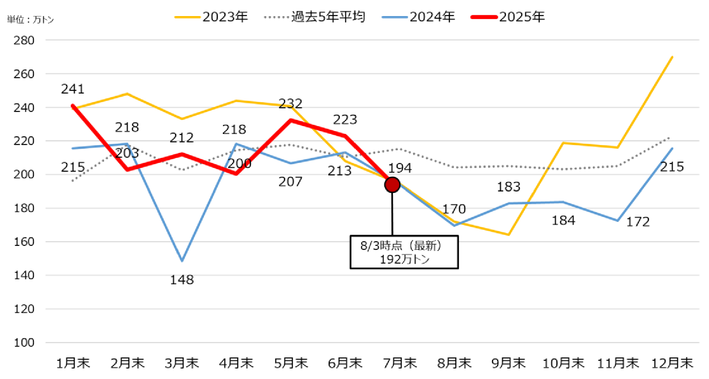

発電用ＬＮＧの在庫状況

令 和  ７ 年 ８  月 ６  日
電  力  基 盤  整  備 課

⚫  全国大の発電用ＬＮＧの在庫量の大幅な低下の予兆をいち早く察知する観点
から、資源エネルギー庁において、大手電力が使用する発電用ＬＮＧの在庫状

況（週末在庫）についてモニタリングを実施し、資源エネルギー庁のＨＰにお
いて公表している。

⚫  8 月 3 日時点の各社の在庫の合計値は以下の通り。

○発電用ＬＮＧの在庫推移                                   （単位：万トン）
週末在庫量        前年同月末※          過去平均※
6/8 時点            234

6/15 時点           214
6/22 時点           227       6 月末     213        210

6/29 時点           214
7/6 時点            199

7/13 時点           187
7/20 時点           192
7 月末     194        215
7/27 時点           179
8/3 時点            192

8/10 時点
8/17 時点
8 月末     170        204
8/24 時点
8/31 時点

以降、需給状況に応じ更新
✓  比較の参考として大手電力の前年同月・2020～2024     年平均の月末在庫量を記載。
✓  在庫量はデッド（物理的に汲み上げ不可な残量）を除く数量。
＜参考＞大手電力の発電用        LNG 月末在庫推移と最新の週末在庫

|  | 週末在庫量 | 前年同月末※ |  | 過去平均※ |
| --- | --- | --- | --- | --- |
| 6/8 時点 | 234 | 6 月末 | 213 | 210 |
| 6/15 時点 | 214 |  |  |  |
| 6/22 時点 | 227 |  |  |  |
| 6/29 時点 | 214 |  |  |  |
| 7/6 時点 | 199 |  |  |  |
| 7/13 時点 | 187 | 7 月末 | 194 | 215 |
| 7/20 時点 | 192 |  |  |  |
| 7/27 時点 | 179 |  |  |  |
| 8/3 時点 | 192 |  |  |  |
| 8/10 時点 |  | 8 月末 | 170 | 204 |
| 8/17 時点 |  |  |  |  |
| 8/24 時点 |  |  |  |  |
| 8/31 時点 |  |  |  |  |
| 以降、需給状況に応じ更新 |  |  |  |  |

